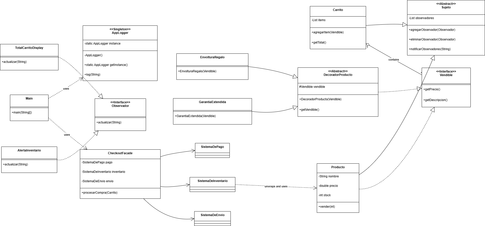

# Tienda Online con Patrones de Diseño

Este proyecto es una simulación de una tienda online por línea de comando, desarrollada en Java como parte de la Actividad Semanal 12. El objetivo principal es aplicar correctamente los patrones de diseño **Singleton**, **Observer**, **Decorator** y **Facade** para construir una solución robusta, coherente y extensible.

---

## Aplicación de Patrones de Diseño

Cada patrón de diseño cumple un rol específico para resolver un problema concreto dentro de la aplicación.

### 1. Singleton
* **Propósito**: Garantizar que exista una única instancia de una clase en toda la aplicación.
* **Implementación**: Se utilizó para la clase `AppLogger`. Esto asegura que todos los eventos del sistema (inicio de la aplicación, alertas de inventario, finalización de compras) se registren a través de un único punto de acceso (`AppLogger.getInstance().log(...)`). De esta forma, se evita tener múltiples logs desorganizados y se centraliza la gestión de eventos.

### 2. Observer
* **Propósito**: Crear un mecanismo de suscripción donde múltiples objetos (observadores) son notificados automáticamente cuando el estado de otro objeto (sujeto) cambia.
* **Implementación**:
    1.  El `Carrito` actúa como **Sujeto**. Cuando se agrega un producto, notifica a sus observadores (como `TotalCarritoDisplay`) para que la interfaz se actualice con el nuevo total.
    2.  El `Producto` también es un **Sujeto**. Cuando su stock llega a cero, notifica a un observador (`AlertaInventario`) para que el sistema pueda reaccionar, por ejemplo, registrando una alerta crítica en el log.

### 3. Decorator
* **Propósito**: Añadir funcionalidades o responsabilidades adicionales a un objeto de forma dinámica y flexible, sin tener que modificar su clase.
* **Implementación**: Se utilizó para añadir "extras" a los productos. La interfaz `Vendible` es el contrato común. La clase `Producto` es el objeto base. Las clases `EnvolturaRegalo` y `GarantiaExtendida` son **decoradores** que "envuelven" a un `Vendible` para añadirle su descripción y costo, alterando el resultado final sin cambiar el objeto original. Esto permite combinaciones flexibles como `new EnvolturaRegalo(new GarantiaExtendida(producto))`.

### 4. Facade
* **Propósito**: Proveer una interfaz simplificada y unificada para un conjunto de subsistemas complejos.
* **Implementación**: El proceso de checkout involucra múltiples pasos: procesar el pago, actualizar el inventario y preparar el envío. La clase `CheckoutFacade` encapsula toda esta complejidad. El cliente (el `main`) solo necesita llamar a un único método (`checkout.procesarCompra(carrito)`), y la fachada se encarga de orquestar las llamadas a los `SistemaDePago`, `SistemaDeInventario` y `SistemaDeEnvio` en el orden correcto.

---

##  UML - Diagrama de Clases

## Instrucciones de compilación y Ejecución
Para compilar y ejecutar el proyecto correctamente desde la línea de comandos, es necesario especificar la codificación de caracteres UTF-8 para asegurar que los acentos y caracteres especiales se muestren correctamente.

### 1. Abrir una terminal o consola de comandos.

### 2. Navegar hasta la carpeta `src` del proyecto.

`cd ruta/a/tu-proyecto/p2actividadsemanal12/src`

### 3. Compilar el proyecto usando la bandera `-encoding UTF-8`.

`javac -encoding UTF-8 com/p2actividadsemanal12/P2actividadsemanal12.java`

### 4. Ejecutar el programa usando la bandera `-Dfile.encoding=UTF-8`.

`java -Dfile.encoding=UTF-8 com.p2actividadsemanal12.Main`

## Reflexión final
### 1. ¿Cuál fue el patrón más difícil de aplicar en este contexto y por qué?
El patrón que más me costó entender e implementar correctamente fue el Facade. Al principio, la idea de crear una clase solo para llamar a otras clases parecía añadir una capa innecesaria de complejidad. Me resultaba difícil ver el beneficio real de ocultar los subsistemas, ya que en un ejemplo pequeño como este, las llamadas directas no parecían tan complicadas. Sin embargo, el desafío real fue darme cuenta de que el valor del Facade no está en simplificar tres o cuatro líneas de código, sino en desacoplar el cliente de todo un proceso de negocio complejo. Entender que la CheckoutFacade define un contrato simple para una operación que podría crecer enormemente añadiendo validaciones, envío de correos, etc. eso fue lo que en verdad me ayudó a comprender su verdadero poder para mantener el código limpio y escalable a largo plazo.

### 2. ¿Cómo se relacionan entre sí los patrones utilizados en tu diseño?
Los patrones en este proyecto no operan de forma aislada, sino que se conectan y colaboran entre sí para crear un sistema coherente. El Decorator permite crear objetos Vendible complejos, que son gestionados por el Carrito. Cuando el Carrito cambia, notifica a sus observadores. Todo este flujo de compra culmina en la llamada a la CheckoutFacade, que toma los productos y orquesta los subsistemas. Uno de estos subsistemas, el de inventario, interactúa con el Producto, lo que puede disparar una notificación de stock. Finalmente, tanto la Facade como los Observadores utilizan la única instancia del AppLogger para registrar eventos importantes, centralizando así toda la información de la ejecución del programa.